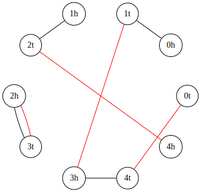

# TruEst: the estimator of true evolutionary distance under the INFER model

## Requirements
You need installed **Python 3** and have bash alias `python` for it. 
Also, some libraries are required: `numpy, scipy, networkx, pygraphviz`.

## About
This repository contains the implementation of the INFER model and the supplementary code.

### Breakpoint Graphs
All graphs are presented in `graphs` package and have methods for counting required statistics and drawing itself such as:
- `p_even()` — number of even paths in graph;
- `p_odd()` — number of odd paths in graph;
- `p_m(m)` — number of `m`-paths in graph;
- `chr()` — estimated number of chromosomes in graph;
- `c()` — number of cycles paths in graph;
- `c_m(m)` — number of `m`-cycles paths in graph;
- `n()` — number of all blocks in graph;
- `d()` — the minimal DCJ distance;
- `b()` — is half the number of breakpoints;
- `save_pygraphviz(filename)` — save graph to `filename` file, 
you can specify `.svg` exension of file for getting an image or do not specify for getting file in *pygraphviz* format.

#### Cyclic genomes
Cyclic genome graphs are presented with `CyclicGenomeGraph` class in file `cyclic_genome_graph.py` file 
and can be used for simulate genome rearrangements with `do_k2_break()` method. 

Parameter `n` need to be passed to the constructor.
Also, initial distribution can be passed by specifying `distribution` from `scipy.stats` library and it's `params` for its params.

Examples:
```python
from src.graphs.cyclic_genome_graph import CyclicGenomeGraph

# Cyclic genome graph with `1000` fragile regions in initial state
g = CyclicGenomeGraph(n=1000) 
g.do_k2_break()
```

```python
from src.graphs.cyclic_genome_graph import CyclicGenomeGraph

# Cyclic genome graph with `1000` fragile regions in initial state with gamma distribution on edges
g = CyclicGenomeGraph(n=1000, distribution="gamma", params=[1/3, 0, 1])
g.do_k2_break()
```

#### Linear genomes
Linear genome graphs are presented with `LinearGenomeGraph` class in file `linear_genome_graph.py` file.
It's completely the same as a `CyclicGenomeGraph` in usage, but also need to specify the initial number of chromosomes in the constructor.

Examples:
```python
from src.graphs.linear_genome_graph import LinearGenomeGraph

# Cyclic genome graph with `1000` fragile regions and `10` chromosomes in initial state
g = LinearGenomeGraph(n=1000, chrs=10) 
g.do_k2_break()
```

```python
from src.graphs.linear_genome_graph import LinearGenomeGraph

# Cyclic genome graph with `1000` fragile regions and `10` chromosomes in initial state with gamma distribution on edges
g = LinearGenomeGraph(n=1000, chrs=10, distribution="gamma", params=[1/3, 0, 1])
g.do_k2_break()
```

#### Real data genomes
Real genomes can be analysed by `RealDataGraph` class from file `real_data_graph.py` file.
Also, this class is wrapped with bash script and can be used without writing source code.
So the application of real data will be described below.


### Estimators
All estimators are presented in `estimators` package and have methods: 
- `predict_k(g)` — pass graph from `graphs` package for prediction of `k` parameter;
- `predict_n(g)` — pass graph from `graphs` package for prediction of `n` parameter;
- `predict(g)` — for predicting both previous. 

#### Uniform Estimator
Uniform estimator is presented with with `UniformDBEstimator` class in `uniform_db_estimator.py` file. 
This estimator assumes that probabilities are uniformly distributed.

#### Flat Dirichlet Estimator
Flat dirichlet estimator is presented with with `FlatDirichletDBEstimator` class in `flat_dirichlet_estimator.py` file. 
This estimator assumes that probabilities are distributed with flat Dirichlet distribution.

#### Original Flat Dirichlet Estimator
Implemented flat dirichlet estimator from [original paper](https://academic.oup.com/gbe/article/8/5/1427/2939585) is presented with with `TannierEstimator` class in `tannier_dbc2_estimator.py` file
and also requires to pass `c2` parameter to `predict*()` methods. 
This estimator assumes that probabilities are distributed with flat Dirichlet distribution.

#### Non-flat Dirichlet Estimator
Non-flat dirichlet estimator is presented with with `DirichletDBEstimator` class in `dirichlet_db_estimator.py` file. 
This estimator assumes that probabilities are distributed with Dirichlet distribution with parameter `alpha`.
You need to **pass `alpha` to constructor**.

#### Corrected Non-flat Dirichlet Estimator
Corrected non-flat dirichlet estimator is presented with with `CorrectedDirichletDBEstimator` class in `dirichlet_db_estimator.py` file. 
This estimator assumes that probabilities are distributed with Dirichlet distribution with parameter `alpha` and also applies the correction for the linear case.
You need to **pass `alpha` to constructor**.

## Usage examples
This project has some code example in the `src` folder and wrapped files for using real data.
You can run it by yourself with your favorite IDE with specifying the working directory as the project directory 
or using bash scripts.

### Real Data
Estimating with real data is provided with `real_data_est_grimm.py` and `real_data_est_infercars.py` python files.
You can pass parameters to this file by yourself or use bash scripts.
Also you can always **use `-h` option to get help**.

#### Real Data in `grimm` Format
Real data in `grimm` format can be estimated with `run_estimate_grimm.sh` script.

You can pass `-h/--help` option to get help:
```
$ ./run_estimate_grimm.sh -h
usage: real_data_est_grimm.py [-h] --file1 FILE1 --file2 FILE2 [--alpha ALPHA]
                              [--stats]

Construct a breakpoint graph with real data provided in grimm format. Then
calculates the necessary statistics and estimate true evolutionary distance
using different approaches.

required arguments:
  --file1 FILE1, -f1 FILE1
                        Path to first file in grimm format
  --file2 FILE2, -f2 FILE2
                        Path to second file in grimm format

optional arguments:
  --alpha ALPHA, -a ALPHA
                        Set alpha to a specific value. Float, default value is
                        0.33
  --stats, -s           Show main statistics of the graph: b, d, p_even, p_odd
                        and paths and cycles count

```

### Input examples:
```bash
./run_estimate_grimm.sh --file1 example_data/H.gen --file2 example_data/M.gen
```

**Specifying alpha** for the Dirichlet estimator:
```bash
./run_estimate_grimm.sh --file1 example_data/H.gen --file2 example_data/M.gen --alpha 0.5
```

**Getting** additional statistics:
```bash
./run_estimate_grimm.sh --file1 example_data/H.gen --file2 example_data/M.gen --stats
```

#### Real Data in `infercars` Format
Real data in `infercars` format can be estimated with `run_estimate_infercars.sh` script.

You can pass `-h/--help` option to get help:

```
$ ./run_estimate_infercars.sh -h
usage: real_data_est_infercars.py [-h] --file FILE --species1 SPECIES1
                                  --species2 SPECIES2 [--fit_alpha]
                                  [--alpha ALPHA] [--stats]

Construct a breakpoint graph with real data provided in infercars format. Then
calculates the necessary statistics and estimate true evolutionary distance
using different approaches.

required arguments:
  --file FILE, -f FILE  Path to file in infercars format
  --species1 SPECIES1, -s1 SPECIES1
                        Name of first species
  --species2 SPECIES2, -s2 SPECIES2
                        Name of second species

optional arguments:
  --fit_alpha, -fa      Fit alpha
  --alpha ALPHA, -a ALPHA
                        Set alpha to a specific value. Float value, default is
                        0.33
  --stats, -s           Show main statistics of the graph: b, d, p_even, p_odd
                        and paths and cycles count
```

### Input examples:
Minimal working example:
```bash
./run_estimate_infercars.sh --file example_data/Conserved.Segments --species1 hg19 --species2 mm10
```

You can specify alpha and get additional statistics as in `grimm` format:
```bash
./run_estimate_infercars.sh --file example_data/Conserved.Segments --species1 hg19 --species2 mm10 --alpha 0.5 --stats
```

Or **fit alpha** for the Dirichlet estimator by passing `--fit_alpha/-fa` option.

```bash
./run_estimate_infercars.sh --file example_data/Conserved.Segments --species1 hg19 --species2 mm10 --fit_alpha
```

#### Output example:
```
Uniform estimator, k: 294.52810322545884
Flat Dirichlet estimator, k: 302.5027390481186
Dirichlet estimator with alpha=0.3333333333333333, k: 307.70047562385764
Corrected dirichlet estimator with alpha=0.3333333333333333, k: 307.70047562385764
```

### Estimation After `k` Breaks
Estimating after `k` breaks in simulations example is provided in `estimation_example.py` python file and `run_etimation_example.sh` bash script.
Also, you can take a look at the source code of that file and easily change used graph or number of steps.

### Draw Graph Example
Draw example is provided in `draw_example.py` python file and `run_drawer_example.sh` bash script.
Also, you can look at the source code of that file, it's pretty easy and you can draw any breakpoint graph.
Here is example of output picture.

