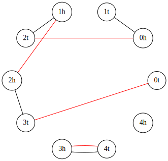

## Requirements
You need installed **Python 3** and have bash alias `python` for it. 
Also, some libraries are required: `numpy, scipy, networkx, pygraphviz`.

## About
This repository contains the implementation of the INFER model and the supplementary code.

### Breakpoint Graphs
All graphs are presented in `graphs` package and have methods for counting required statistics and drawing itself such as:
- `p_even()` — number of even paths in graph;
- `p_odd()` — number of odd paths in graph;
- `p_m(m)` — number of `m`-paths in graph;
- `chr()` — estimated number of chromosomes in graph;
- `c()` — number of cycles paths in graph;
- `c_m(m)` — number of `m`-cycles paths in graph;
- `n()` — number of all blocks in graph;
- `d()` — the minimal DCJ distance between;
- `b()` — is half the number of breakpoints;
- `save_pygraphviz(filename)` — save graph to `filename` file, 
you can specify `.svg` exension of file for getting an image or do not specify for getting file in *pygraphviz* format.

#### Cyclic genomes
Cyclic genome graphs are presented with `CyclicGenomeGraph` class in file `cyclic_genome_graph.py` file 
and can be used for simulate genome rearrangements with `do_k2_break()` method. 
You need to pass `n` to the constructor 
and you can also pass distribution from `scipy.stats` library and it's params to constructor method for specifying fragilities distribution.

Examples:
```python
from src.graphs.cyclic_genome_graph import CyclicGenomeGraph

# Cyclic genome graph with `1000` fragile regions in initial state
g = CyclicGenomeGraph(n=1000) 
g.do_k2_break()
```

```python
from src.graphs.cyclic_genome_graph import CyclicGenomeGraph

g = CyclicGenomeGraph(n=1000, distribution="gamma", params=[1/3, 0, 1]) # Cyclic genome graph with `1000` fragile regions in initial state with gamma distribution on edges
g.do_k2_break()
```

#### Linear genomes
Linear genome graphs are presented with `LinearGenomeGraph` class in file `linear_genome_graph.py` file.
It's completely the same as a `CyclicGenomeGraph` in usage, but also need to specify the number of chromosomes parameter in the constructor.

Examples:
```python
from src.graphs.linear_genome_graph import LinearGenomeGraph

# Cyclic genome graph with `1000` fragile regions and `10` chromosomes in initial state
g = LinearGenomeGraph(n=1000, chrs=10) 
g.do_k2_break()
```

```python
from src.graphs.linear_genome_graph import LinearGenomeGraph

# Cyclic genome graph with `1000` fragile regions and `10` chromosomes in initial state with gamma distribution on edges
g = LinearGenomeGraph(n=1000, chrs=10, distribution="gamma", params=[1/3, 0, 1])
g.do_k2_break()
```

#### Real data genomes
Real genomes can be analysed by `RealDataGraph` class from file `real_data_graph.py` file.
Also, this class is wrapped with bash script and can be used without writing source code.
So the application of real data will be described below.


### Estimators
All estimators are presented in `estimators` package and have methods: 
- `predict_k(g)` — pass graph from `graphs` package for prediction of `k` parameter;
- `predict_n(g)` — pass graph from `graphs` package for prediction of `n` parameter;
- `predict(g)` — for predicting both previous. 

#### Uniform Estimator
Uniform estimator is presented with with `UniformDBEstimator` class in `uniform_db_estimator.py` file. 
This estimator assumes that probabilities are uniformly distributed.

#### Flat Dirichlet Estimator
Flat dirichlet estimator is presented with with `FlatDirichletDBEstimator` class in `flat_dirichlet_estimator.py` file. 
This estimator assumes that probabilities are distributed with flat Dirichlet distribution.

#### Original Flat Dirichlet Estimator
Implemented flat dirichlet estimator from [original paper](https://academic.oup.com/gbe/article/8/5/1427/2939585) is presented with with `TannierEstimator` class in `tannier_dbc2_estimator.py` file
and also requires to pass `c(2)` parameter to `predict*()` methods. 
This estimator assumes that probabilities are distributed with flat Dirichlet distribution.

#### Non-flat Dirichlet Estimator
Non-flat dirichlet estimator is presented with with `DirichletDBEstimator` class in `dirichlet_db_estimator.py` file. 
This estimator assumes that probabilities are distributed with Dirichlet distribution with parameter `alpha`.
You need to **pass `alpha` to constructor**.

#### Corrected Non-flat Dirichlet Estimator
Corrected non-flat dirichlet estimator is presented with with `CorrectedDirichletDBEstimator` class in `dirichlet_db_estimator.py` file. 
This estimator assumes that probabilities are distributed with Dirichlet distribution with parameter `alpha` and also applies the correction for the linear case.
You need to **pass `alpha` to constructor**.

## Usage examples
This project has several code example and wrapped files for using real data.
You can run it by yourself with your favorite IDE with specifying working directory as project directory 
or using bash script.

### Real Data
Estimating with real data is provided with `real_data_est.py` python file.
You can pass parameters to this file by yourself or use bash scripts.

### Real Data in `grimm` Format
Real data in `grimm` format can be estimated with `run_estimate_grimm.sh` script.

Example input:
```bash
./run_estimate_grimm.sh example_data/H.gen example_data/M.gen
```

Example output:
```
d=408, b=530.5
Uniform estimator, k: 407.83309975090975
Flat Dirichlet estimator, k: 408.06655523000336
Dirichlet estimator with alpha=0.3333333333333333, k: 408.27704725986126
Corrected dirichlet estimator with alpha=0.3333333333333333, k: 408.27704725986126
```

Also, you can **specify alpha** for the Dirichlet estimator by passing third parameter.
Example input:
```bash
./run_estimate_grimm.sh example_data/H.gen example_data/M.gen 0.42
```

Example output:
```
d=408, b=530.5
Uniform estimator, k: 407.83309975090975
Flat Dirichlet estimator, k: 408.06655523000336
Dirichlet estimator with alpha=0.42, k: 408.11174995732927
Corrected dirichlet estimator with alpha=0.42, k: 408.11174995732927
```

### Real Data in `infercars` Format
Real data in `infercars` format can be estimated with `run_estimate_infercars.sh` script.

```bash
./run_estimate_infercars.sh example_data/Conserved.Segments hg19 mm10
```

Example output:
```
d=291, b=334.5
Uniform estimator, k: 294.52810322545884
Flat Dirichlet estimator, k: 302.5027390481186
Dirichlet estimator with alpha=0.3333333333333333, k: 307.70047562385764
Corrected dirichlet estimator with alpha=0.3333333333333333, k: 307.70047562385764
```

Also, you can **specify alpha** for the Dirichlet estimator by passing fourth parameter.

```bash
./run_estimate_infercars.sh example_data/Conserved.Segments hg19 mm10 0.42
```

Example output:
```
d=291, b=334.5
Uniform estimator, k: 294.52810322545884
Flat Dirichlet estimator, k: 302.5027390481186
Dirichlet estimator with alpha=0.42, k: 306.68783805301905
Corrected dirichlet estimator with alpha=0.42, k: 309.5213404589687
```

Or **fit alpha** for the Dirichlet estimator by passing keyword `fit` as fourth parameter.

```bash
./run_estimate_infercars.sh example_data/Conserved.Segments hg19 mm10 fit
```

Example output:
```
Alpha fitted, alpha=0.07755545378416945
d=291, b=334.5
Uniform estimator, k: 294.52810322545884
Flat Dirichlet estimator, k: 302.5027390481186
Dirichlet estimator with alpha=0.07755545378416945, k: 311.704858218553
Corrected dirichlet estimator with alpha=0.07755545378416945, k: 311.704858218553
```

### Estimation After `k` Breaks
Estimating after `k` breaks in simulations example is provided in `estimation_example.py` python file and `run_etimation_example.sh` bash script.
Also, you can take a look at the source code of that file and change used graph or number of steps.

### Draw Graph Example
Draw example is provided in `draw_example.py` python file and `run_drawer_example.sh` bash script.
Also, you can look at the source code of that file, it's pretty easy and you can draw almost any graph.
Here is example of output picture.
